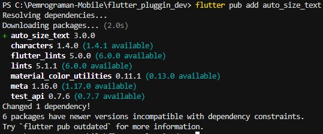
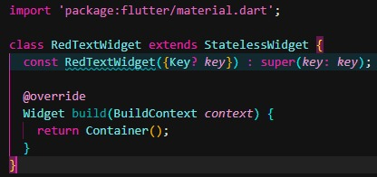
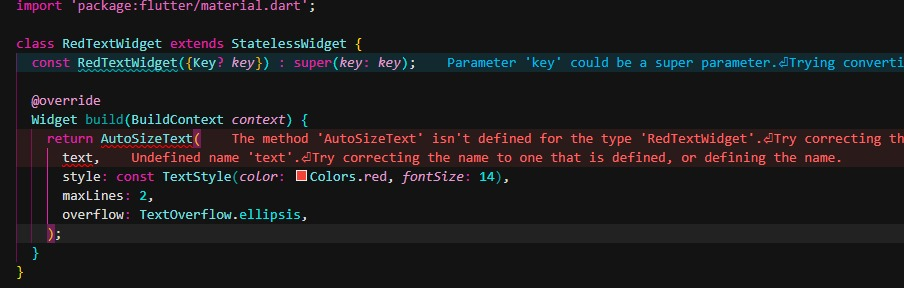
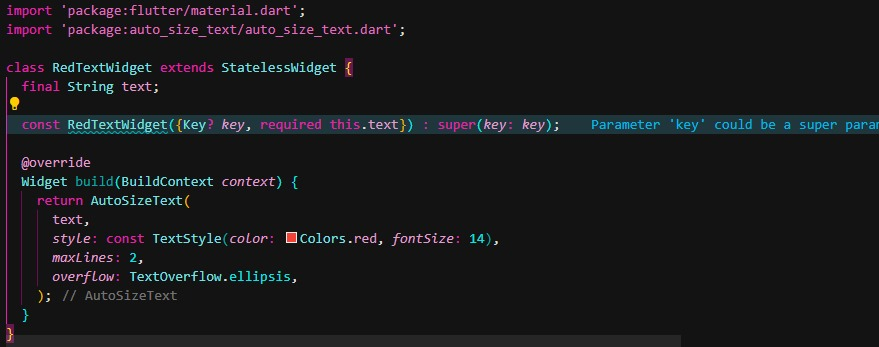
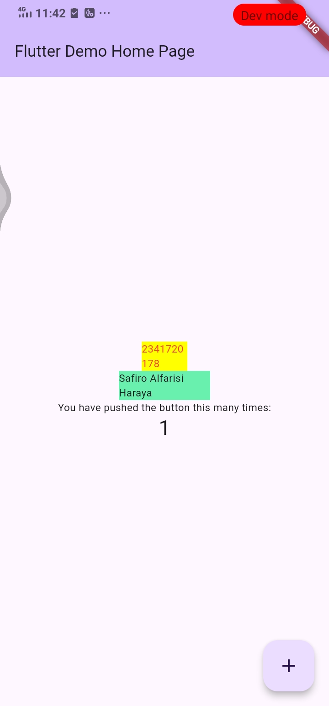

# Codelab 07 - Plugins

## Identitas
- **Nama**  : Safiro Alfarisi Haraya 
- **NIM**   : 2341720178 
- **Kelas** : TI - 3F  

---

# Praktikum 1 – Menerapkan Plugin di Project Flutter

### Langkah 2

### Penjelasan Langkah 2
pada langkah 2 kita akan mendownload plugin auto_size_text dengan menggunakan command flutter pub add auto_size_text

### Langkah 3

### Penjelasan Langkah 3
pada langkah 3 kita membuat widget class baru yang bernama red_text_widget

### Langkah 4

### Penjelasan Langkah 3
pada langkah 4 menambah widget auto_size_text pada red_text_widget dan itu masih error dikarenakan belum mengimport plugin ke dalam widget yang kita mau.Untuk menghilangkan error kita dapat menambahkan "import 'package:auto_size_text/auto_size_text.dart';"

### Langkah 5

### Penjelasan Langkah 5
pada langkah 5 kita menambah variabel text dan parameter di constructor red_text_widget

### Langkah 6

### Penjelasan Langkah 6
pada langkah 6 kita menambahkan container untuk red_text_widget di main dart dan hasil kode yang kita buat ada pada screenshot di atas

# Tugas

### Pertanyaan 1 : Jelaskan maksud dari langkah 2 pada praktikum tersebut!

### Penjelasan Pertanyaan 1
pada command flutter pub add auto_size_text di terminal berarti kita baru saja menambahkan plugin auto_size_text ke dalam framework dan otomatis pubsec.yaml dll akan mengkonfigurasi itu agar bekerja dengan baik.

### Pertanyaan 2 : Jelaskan maksud dari langkah 5 pada praktikum tersebut!

### Penjelasan Pertanyaan 2
penambahan variabel text dan contructor pada widget red_text_widget dan final yang berarti variabel text harus punya nilai dan nilainya tetap.

### Pertanyaan 3 : Pada langkah 6 terdapat dua widget yang ditambahkan, jelaskan fungsi dan perbedaannya!

### Penjelasan Pertanyaan 3
perbedaan 2 container pada child class _MyHomePageState adalah lebar dan warnanya.

### Pertanyaan 4 : Jelaskan maksud dari tiap parameter yang ada di dalam plugin auto_size_text berdasarkan tautan pada dokumentasi ini !

### Penjelasan Pertanyaan 4
| Parameter               | Penjelasan                                                                         | Catatan                                                                        |
| ----------------------- | ---------------------------------------------------------------------------------- | ------------------------------------------------------------------------------ |
| **key**                 | Mengontrol bagaimana widget ini menggantikan widget lain di tree.                  | Sama seperti `Key` pada widget biasa.                                          |
| **textKey**             | Menetapkan *key* khusus untuk widget `Text` di dalamnya.                           | Digunakan jika perlu identifikasi `Text` internal.                             |
| **style**               | Menentukan gaya teks seperti font, warna, ketebalan, dll.                          | Sama seperti parameter `style` di widget `Text`.                               |
| **minFontSize**         | Ukuran huruf minimum saat disesuaikan agar muat di layout.                         | Jika teks masih overflow pada ukuran ini, akan mengikuti `overflow`.           |
| **maxFontSize**         | Ukuran huruf maksimum.                                                             | Mencegah teks menjadi terlalu besar.                                           |
| **stepGranularity**     | Besaran langkah saat ukuran huruf dikurangi untuk menyesuaikan ruang.              | Semakin kecil nilainya → semakin halus penyesuaiannya.                         |
| **presetFontSizes**     | Daftar ukuran font yang sudah ditentukan.                                          | Jika digunakan, `minFontSize`, `maxFontSize`, dan `stepGranularity` diabaikan. |
| **group**               | Mengelompokkan beberapa `AutoSizeText` agar semua memiliki ukuran huruf yang sama. | Cocok untuk tampilan tabel atau grid.                                          |
| **textAlign**           | Menentukan perataan teks secara horizontal.                                        | Sama seperti `TextAlign` pada `Text`.                                          |
| **textDirection**       | Menentukan arah penulisan (LTR/RTL).                                               | Mengatur interpretasi `TextAlign.start` dan `TextAlign.end`.                   |
| **locale**              | Menentukan lokalisasi yang digunakan dalam rendering font.                         | Berguna untuk karakter yang berbeda antar bahasa.                              |
| **softWrap**            | Apakah teks boleh memecah baris di titik “soft break”.                             | Default: `true`.                                                               |
| **wrapWords**           | Apakah kata yang panjang boleh dipotong dan dibungkus ke baris baru.               | Default: `true`.                                                               |
| **overflow**            | Menentukan perilaku ketika teks meluap dari batas.                                 | Contoh: `TextOverflow.ellipsis`.                                               |
| **overflowReplacement** | Widget pengganti ketika teks tidak bisa disusutkan agar muat.                      | Misalnya, bisa ganti dengan `Text("Teks terlalu panjang")`.                    |
| **textScaleFactor**     | Faktor skala teks terhadap ukuran font dasar.                                      | Mempengaruhi semua ukuran font.                                                |
| **maxLines**            | Jumlah maksimum baris yang boleh ditampilkan.                                      | Jika lebih, teks disusutkan atau di-ellipsis.                                  |
| **semanticsLabel**      | Label alternatif untuk keperluan aksesibilitas.                                    | Dibaca oleh *screen reader*.                                                   |