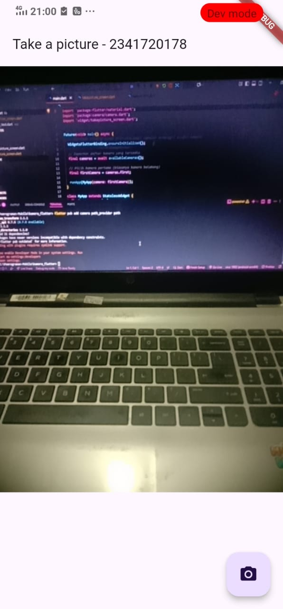
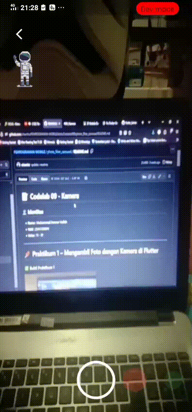

# Codelab 09 - Kamera

## Identitas
- **Nama**  : Safiro Alfarisi Haraya 
- **NIM**   : 2341720178 
- **Kelas** : TI - 3F  

---

# 📌 Praktikum 1 – Mengambil Foto dengan Kamera di Flutter

### ✅ Bukti Praktikum 1

### Penjelasan Praktikum 1
pada praktikum 1 kita diminta untuk bisa membuat akses kamera pada aplikasi yang kita buat dan mengaktifkan persyaratan untuk bisa membuka kamera di aplikasi tersebut.

# 📌 Praktikum 2 – Membuat photo filter carousel

# 📌 Tugas – Codelabs: Membuat aplikasi kamera dengan filter carousel

### ✅ Screenshot Tugas

