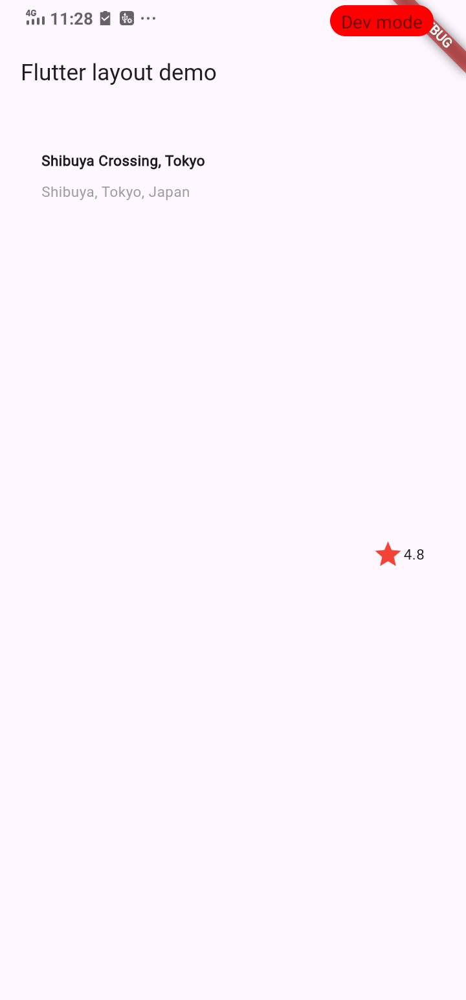
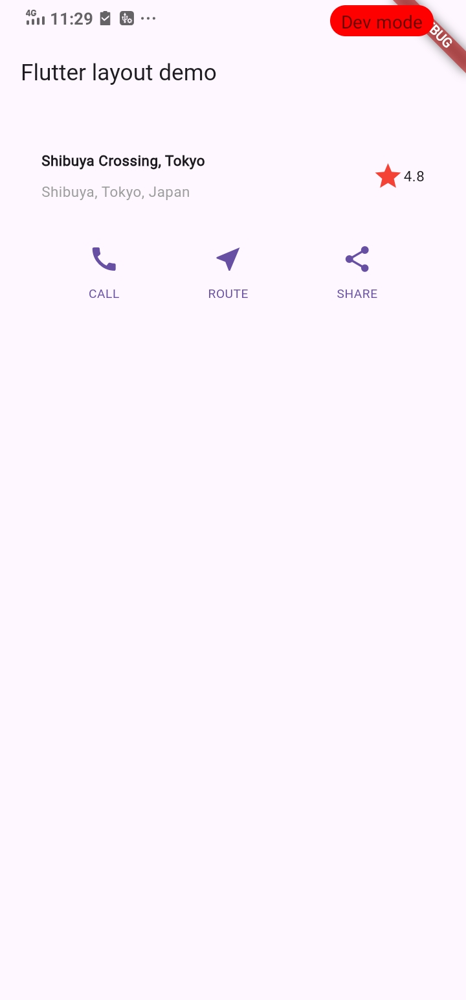
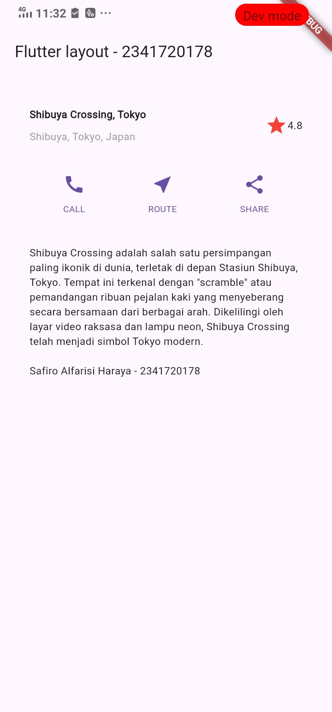
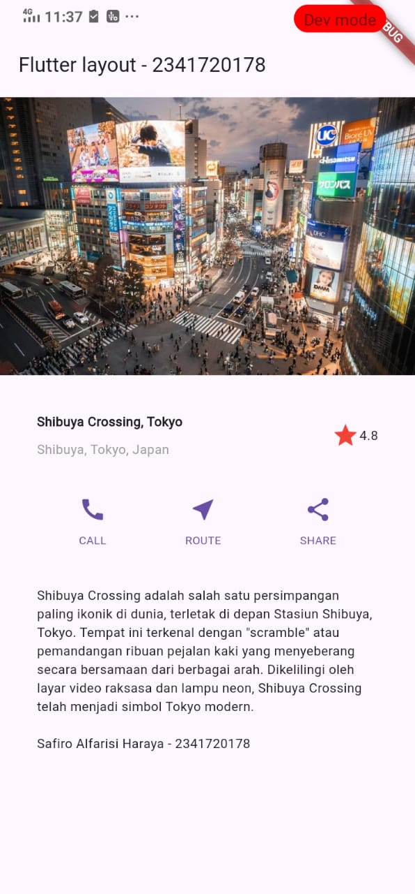

Codelab 06 - Layout

Identitas

    Nama : Safiro Alfarisi Haraya
    NIM : 2341720178
    Kelas : TI - 3F

Praktikum 1 – Membangun Layout di Flutter
Bukti Praktikum 1

Praktikum 1
Penjelasan Praktikum 1

pada praktikum 1 kita diminta untuk bisa membedakan row dan column dan hasil praktikum 1 ada pada gambar di atas

Praktikum 2 – Implementasi button row
Bukti Praktikum 2

Praktikum 2
Penjelasan Praktikum 2

pada praktikum 2 kita diminta untuk membuat row button seperti pada gambar di atas kita membuat row button dan row text yang membuat button call, route, share.

Praktikum 3 – Implementasi text section
Bukti Praktikum 3

Praktikum 3
Penjelasan Praktikum 3

pada praktikum 3 kita diminta untuk membuat text section yang pada di gambar di atas adalah deskripsi yang kita buat

Praktikum 4 – Implementasi image section
Bukti Praktikum 4

Praktikum 4
Penjelasan Praktikum 4

pada praktikum 4 kita diminta untuk memuat image section yang ada pada gambar di atas.
