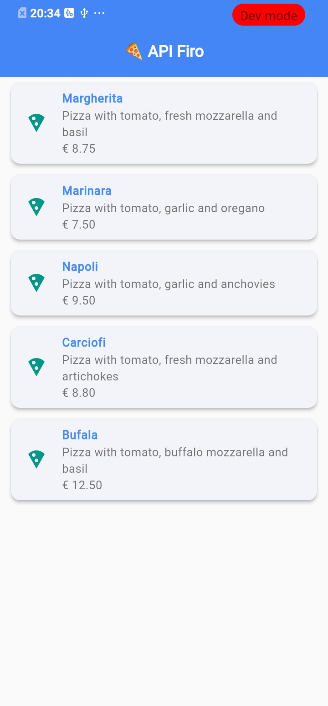
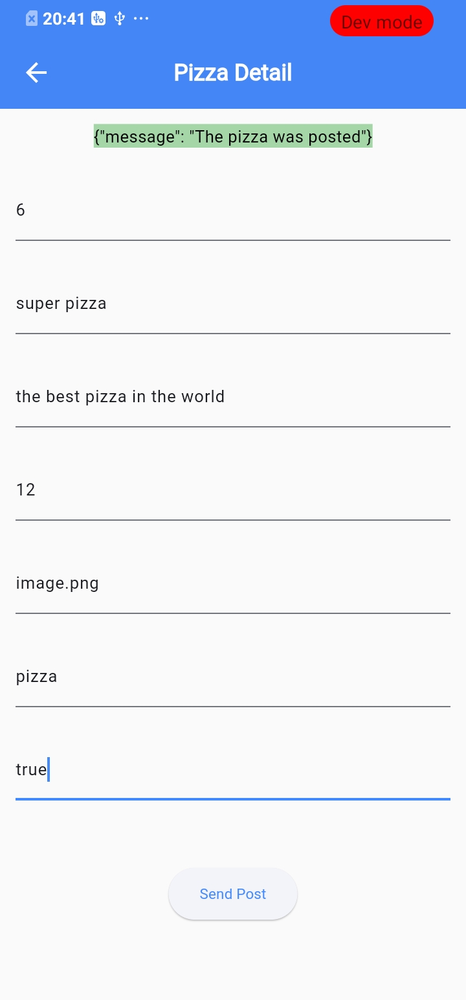
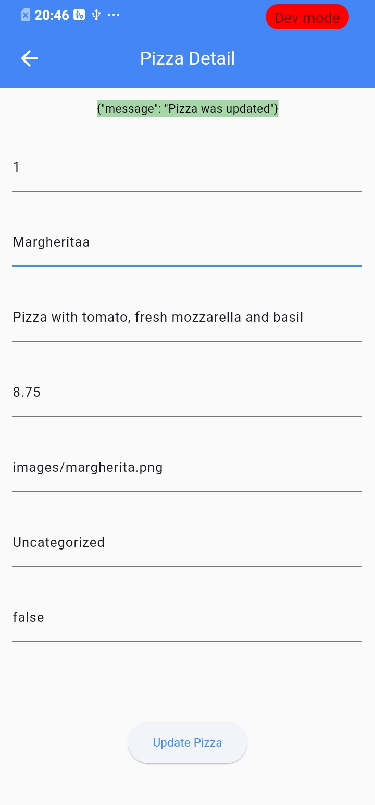

# Codelab 14 – RESTful API
## Identitas

**Safiro Alfarisi Haraya** 2341720178  TI - 3F 

---

##  Praktikum 1 – Membuat layanan Mock API

###  Soal 1  
**Tambahkan nama panggilan Anda pada title app sebagai identitas hasil pekerjaan Anda.**

**Jawaban:**  
``` 
return Scaffold(
      appBar: AppBar(title: const Text('JSON and HTTP Demo - Ammar')),
      body: FutureBuilder(
```
---

### Soal 1.2
**Gantilah warna tema aplikasi sesuai kesukaan Anda.**

**Jawaban:**  
```  
Widget build(BuildContext context) {
    return MaterialApp(
      title: 'Flutter JSON Demo - Ammar',
      theme: ThemeData(primarySwatch: Colors.deepPurple),
      home: const MyHomePage(),
    );
  }
```
---

### Soal 1.3  


**Jawaban:**  

### Bukti Praktikum 1  


---
## Praktikum 2 – Mengirim Data ke Web Service (POST)

### Soal 2  


**Jawaban:**  

```  
const keyId = 'id';
const keyName = 'pizzaName';
const keyDescription = 'description';
const keyPrice = 'price';
const keyImage = 'imageUrl';
const keyCategory = 'category'; #BARU
```

---

### Soal 2.2  


**Jawaban:**  

### Bukti Praktikum 2  


---
## Praktikum 3 – Memperbarui Data di Web Service (PUT)

### Soal 3  


**Jawaban:**  

```  
{"id":2341720074,"pizzaName":"firo","description":"Pizza with tomato, garlic and anchovies","price":9.5,"imageUrl":"images/marinara.png","category":""}
```


---
### Soal 3.2  

** Jawaban:**  

### Bukti Praktikum 3  


---

##  Praktikum 4 – Menghapus Data dari Web Service (DELETE)

###  Soal 4

** Jawaban:**  

### ✅ Bukti Praktikum 4  


---