# Pemrograman Mobile - Pertemuan 3

NIM : 2341720178

NAMA : Safiro Alfarisi Haraya

===  Tugas Praktikum  ===
1. Praktikum 1

Output:

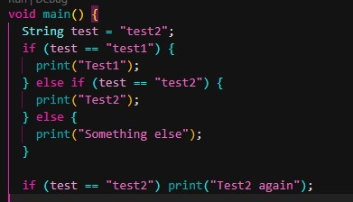

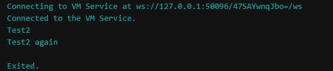

Program ini menunjukkan penggunaan control flow pada Dart. Variabel test diperiksa menggunakan percabangan if / else. Jika kondisi sesuai, program menampilkan hasil sesuai cabang yang terpenuhi. Pada contoh, program berhenti di percabangan kedua dengan kondisi test = Test2.

Output Modifikasi:

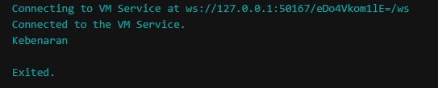

Modifikasi mengubah isi variabel test menjadi "true". Hal ini membuat program menampilkan output sesuai percabangan tambahan yang sebelumnya ditulis pada kode.

2. Praktikum 2

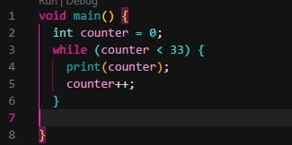

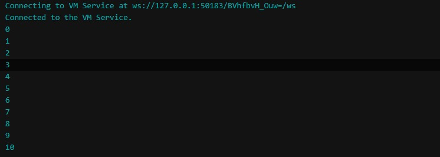

Kode awal mengalami error karena variabel counter belum dideklarasikan, padahal digunakan dalam kondisi perulangan while. Solusinya, counter perlu didefinisikan terlebih dahulu. Pada contoh, counter diberi nilai awal 30 sehingga program dapat berjalan dan menghasilkan output seperti gambar.

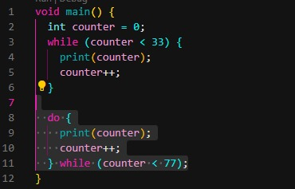

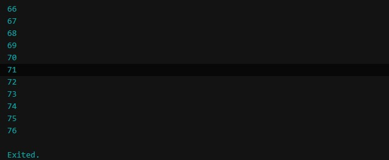

Modifikasi menghasilkan output tambahan dari perulangan. Program terus mencetak nilai counter sampai kondisi counter == 77 tercapai.

3. Praktikum 3

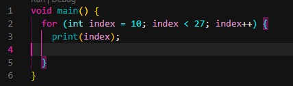

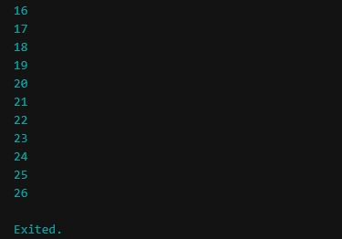

Berbeda dari while, perulangan for langsung mendeklarasikan variabel di dalam strukturnya. Variabel tersebut menjadi iterasi yang digunakan untuk menjalankan perulangan.

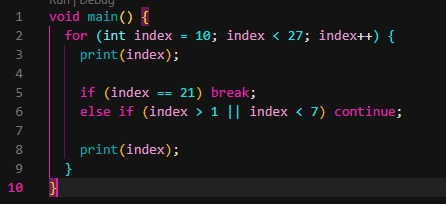

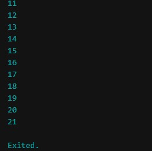

Modifikasi menambahkan kondisi penghentian paksa menggunakan break ketika nilai Index mencapai 21. Akibatnya, program hanya mencetak angka sampai 20.

4. Tugas Praktikum:

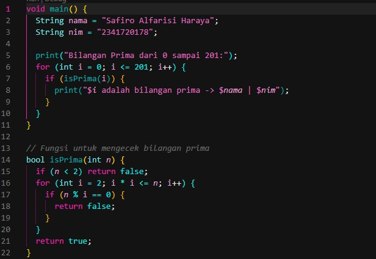

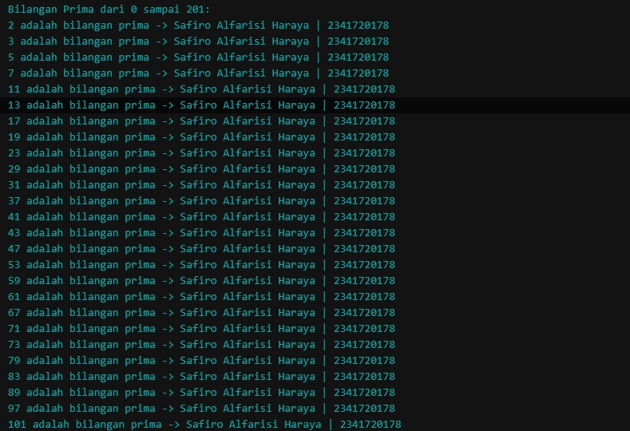